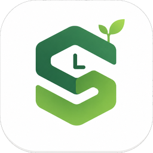

<div align="center">



# Simon 学习助手

**基于西蒙学习法的专注学习计时器 · 帮助你高效学习**

[](https://github.com/MgGaWin/simon-releases/releases)
[]()
[](LICENSE)
[](https://github.com/MgGaWin/simon-releases/releases)
[]()

---

[功能特性](#-功能特性) · [快速开始](#-快速开始) · [快捷键](#-快捷键) · [截图](#-截图) · [数据存储](#-数据存储) · [更新日志](#-更新日志) · [许可证](#-许可证)

</div>

## ✨ 功能特性

| 功能 | 说明 |
|:---|:---|
| 🍅 **番茄工作法** | 25分钟专注 + 5分钟休息，每3轮后30分钟长休息 |
| 📝 **费曼笔记** | 每3轮番茄钟后弹出笔记窗口，用输出倒逼输入 |
| 📅 **学习计划** | 按天规划任务，每日任务一目了然 |
| 📊 **数据统计** | 连续天数、本周专注时长、完成率一览 |
| 🗓️ **学习热力图** | GitHub 风格年度热力图，记录你的每一天 |
| 🌐 **中英双语** | 支持中文/英文界面切换 |
| 🔔 **系统托盘** | 最小化到托盘，不干扰工作 |
| ⌨️ **全局快捷键** | 无需切换窗口，随时控制计时器 |
| 📦 **免安装依赖** | 单文件 exe，下载即用，无需 Python 环境 |

## 🚀 快速开始

### 下载安装

1. 前往 [Releases](https://github.com/MgGaWin/simon-releases/releases) 页面
2. 下载最新版本的 `Simon学习助手_vX.X.X_Setup.exe`
3. 运行安装程序，按提示完成安装
4. 启动后自动最小化到系统托盘

> **系统要求：** Windows 10 / 11（64位），无需安装 Python 或其他依赖

### 基本使用

1. **启动应用** — 程序启动后最小化到系统托盘，双击图标打开主窗口
2. **设置计划** — 在「学习计划」中添加每日任务
3. **开始专注** — 点击开始按钮或按 `Ctrl+Space`
4. **完成一轮** — 25分钟后自动进入休息，3轮后弹出费曼笔记
5. **查看统计** — 在「统计」页面查看学习数据和热力图

## ⌨️ 快捷键

| 快捷键 | 功能 |
|:---|:---|
| `Ctrl + Space` | 开始 / 暂停计时 |
| `Ctrl + Shift + N` | 跳过当前阶段 |
| `Ctrl + Shift + S` | 停止计时 |
| `Ctrl + 1` ~ `Ctrl + 5` | 切换标签页 |
| `Ctrl + W` | 隐藏到系统托盘 |
| `Ctrl + Q` | 退出应用 |

## 📸 截图

> 欢迎提交 PR 添加截图！

## 💾 数据存储

所有数据本地存储在 `data/` 目录下：

| 文件 | 说明 |
|:---|:---|
| `plan.json` | 学习计划（按天存储任务） |
| `daily_log.json` | 每日学习记录（完成率、时长） |
| `notes.json` | 费曼笔记 |
| `settings.json` | 用户设置（时长、语言等） |

> 💡 数据完全离线，无需联网，隐私安全有保障。

## 🔧 自定义设置

在 `settings.json` 中可调整：

```json
{
  "focus_minutes": 25,
  "short_break_minutes": 5,
  "long_break_minutes": 30,
  "daily_goal_hours": 4,
  "sound_enabled": true,
  "language": "zh"
}
```

## 📋 更新日志

### v1.1.0
- 新增学习热力图年度视图
- 新增中英双语支持
- 优化系统托盘交互
- 修复若干已知问题

### v1.0.0
- 首次发布
- 番茄工作法计时器
- 费曼笔记系统
- 学习计划管理
- 数据统计面板

## 🤝 贡献

欢迎提交 Issue 和 Pull Request！

1. Fork 本仓库
2. 创建功能分支：`git checkout -b feature/amazing-feature`
3. 提交更改：`git commit -m 'Add amazing feature'`
4. 推送分支：`git push origin feature/amazing-feature`
5. 提交 Pull Request

## 📄 许可证

本项目基于 [MIT License](LICENSE) 开源。

---

<div align="center">

**如果觉得有用，请给个 ⭐ Star 支持一下！**

</div>
